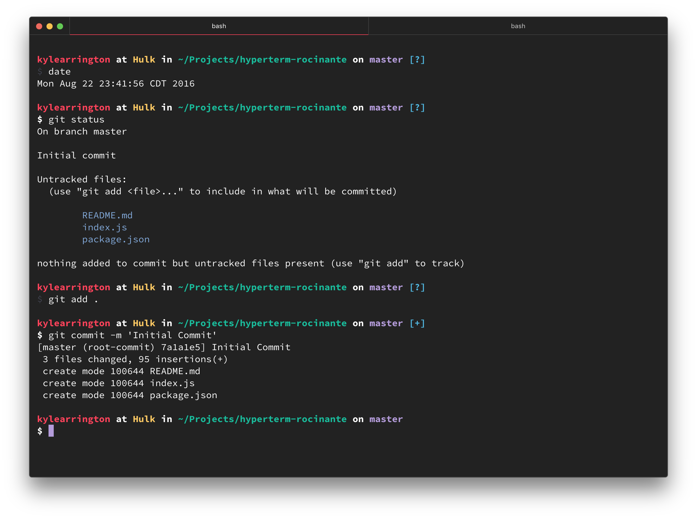

# hyperterm-rocinante

> A dark yet juicy theme for [HyperTerm](https://hyperterm.org)

## Install

Add `hyperterm-rocinante` to the plugins list in your `~/.hyperterm.js` config file.

## Attribution

Palette based on the sublime [enki](https://github.com/enkia/enki-theme) theme enki-alt color scheme.

## License

MIT © [Kyle Arrington](http://github.com/gig3m)
